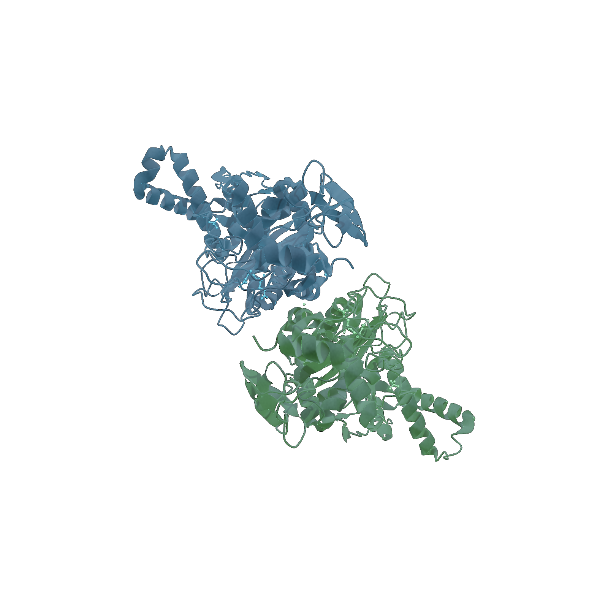
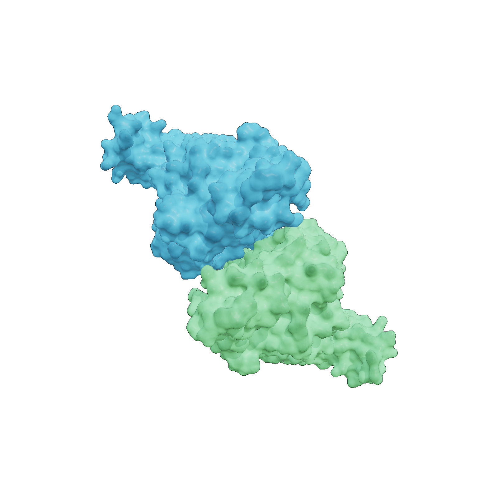

# RusMol

**A Rust-based lightweight molecular structure viewer** for proteins and
nucleic acids — a PyMOL-compatible command set, interactive 3D rendering, and
sub-second cold start, built on [wgpu](https://wgpu.rs/).

[](#license)


<p align="center">
  
</p>

---

## Features

- **Representations** — ribbon/cartoon (with secondary-structure smoothing),
  ball-and-stick, stick, backbone/trace, lines, and molecular **surface**
  (Gaussian or SES).
- **PyMOL-compatible commands** — `show`, `hide`, `color`, `select`, `set`,
  `zoom`, and more, entered at an interactive `RusMol>` prompt or via `-c`.
- **Selection language** — `chain`, `resn`, `resi`, `name`, `elem`, `hetatm`,
  combined with `and` / `or` / `not` / parentheses.
- **Coloring** — by element (CPK), chain, secondary structure, spectrum
  (N→C rainbow), or B-factor, plus named colors.
- **Modern rendering** — PBR shading, shadows, SSAO, bloom, edge outlines, and
  a second adjustable light source.
- **GUI presets** — Default, Chain Surface, Binding Site (protein contacts as
  sticks + ligand–protein H-bonds), and Pocket Surface.
- **Docking trace playback** — step through an AutoDock-style optimization
  trajectory (`docktrace`).
- **PNG export** — `png <file>` for scriptable, headless-style screenshots.
- **File formats** — PDB and PDBQT.

<p align="center">
  
  <br>
  <em>Per-chain molecular surface (<code>show surface; color chain</code>).</em>
</p>

## Platform

RusMol currently renders through the **Metal** backend and therefore runs on
**macOS only** (Apple Silicon and Intel). Linux/Windows are not yet supported;
the backend selection is a single line in `src/render/state.rs`, so a
cross-platform build is feasible but has not been tested.

## Installation

RusMol is built from source with the Rust toolchain.

### 1. Install Rust

```sh
curl --proto '=https' --tlsv1.2 -sSf https://sh.rustup.rs | sh
```

RusMol requires Rust **1.80 or newer** (edition 2021).

### 2. Build

```sh
git clone https://github.com/ishida-titech/rusmol.git
cd rusmol
cargo build --release
```

The optimized binary is written to `target/release/rusmol`.

### 3. (Optional) Install to your PATH

```sh
cargo install --path .
```

## Quick Start

The repository ships with sample structures under `tests/`. Try them right away:

```sh
# A small protein (crambin)
cargo run --release -- tests/fixtures/1crn.pdb

# A larger two-chain structure, colored by chain
cargo run --release -- tests/fixtures/2je5.pdb -c "color chain"

# A docking receptor + ligand, shown as a per-chain surface
cargo run --release -- tests/dock_trace/receptor.pdbqt tests/dock_trace/ligand.pdbqt \
  -c "show surface; color chain"

# Fully scripted, headless-style: render to PNG and quit
cargo run --release -- tests/fixtures/2je5.pdb \
  -c "show surface; color chain; bg white; png out.png; quit"
```

RusMol opens a 3D window and an interactive prompt in the terminal. Type
`help` at the `RusMol>` prompt for the full command reference.

### Basic controls

| Input | Action |
| --- | --- |
| Left-drag | Rotate |
| Right-drag / scroll | Zoom |
| Middle-drag | Pan |
| Click atom | Pick / identify |

See **[MANUAL.md](MANUAL.md)** for the complete guide: every command, the
selection language, all settings, mouse/keyboard shortcuts, and the GUI toolbar.

## Command-line usage

```
rusmol [OPTIONS] <FILES>...

Arguments:
  <FILES>...            Molecular structure file(s) to load (PDB / PDBQT)

Options:
  -c, --command <CMD>   Run a ';'-separated command string after loading,
                        then keep the prompt open
  -v, --verbose         Print verbose (info-level) diagnostics
  -h, --help            Print help
  -V, --version         Print version
```

## Sample data

| Path | Description |
| --- | --- |
| `tests/fixtures/1crn.pdb` | Crambin — a small 46-residue protein |
| `tests/fixtures/2je5.pdb` | A larger two-chain structure |
| `tests/dock_trace/receptor.pdbqt` | Docking receptor (PDBQT) |
| `tests/dock_trace/ligand.pdbqt` | Docking ligand (PDBQT) |
| `tests/dock_trace/1lpz.tpe_fast.trace` | Sample docking-optimization trace |

`1crn` and `2je5` are publicly available entries from the
[RCSB Protein Data Bank](https://www.rcsb.org/). These files double as the
fixtures for the test suite (`cargo test`).

## Documentation

- **[MANUAL.md](MANUAL.md)** — full user manual.
- In-app: type `help` at the `RusMol>` prompt.

## Contributing

Issues and pull requests are welcome. Please run `cargo test` and
`cargo clippy` before submitting. Cross-platform (Vulkan/DX12) testing help is
especially appreciated.

## License

Licensed under either of

- MIT License ([LICENSE-MIT](LICENSE-MIT))
- Apache License, Version 2.0 ([LICENSE-APACHE](LICENSE-APACHE))

at your option.

Unless you explicitly state otherwise, any contribution intentionally submitted
for inclusion in this work by you, as defined in the Apache-2.0 license, shall
be dual licensed as above, without any additional terms or conditions.
